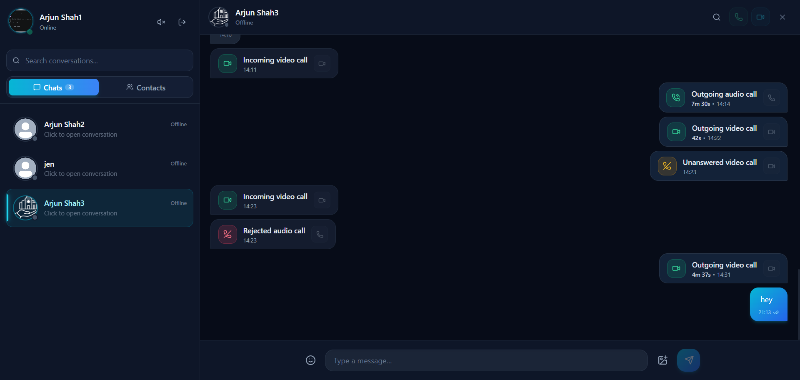

<h1 align="center">💬 Full-Stack Real-Time Chat App</h1>

<br>

<p align="center">
  
</p>
This is a full-stack real-time messaging application designed to provide a smooth and modern chatting experience.

---

## 🚀 Features

* 🔐 Custom JWT Authentication (no 3rd-party auth)
* ⚡ Real-time Messaging via Socket.io
* 🟢 Online/Offline Presence Indicators
* 🔔 Notification & Typing Sounds (with toggle)
* 📨 Welcome Emails on Signup (Resend)
* 🧰 REST API with Node.js & Express
* 🗂️ Image Uploads (Cloudinary)
* 🚦 API Rate-Limiting powered by Arcjet
* 🧱 MongoDB for Data Persistence
* 🧠 Zustand for State Management
* 🎨 Beautiful UI with React, Tailwind CSS & DaisyUI
* 🧑‍💻 Git & GitHub Workflow (branches, PRs, merges)
* 🚀 Easy Deployment (free-tier)

---

## 🛠️ Tech Stack

### 🎨 Frontend

```text
React
Tailwind CSS
DaisyUI
Zustand
Axios
Socket.io Client
```

### ⚙️ Backend

```text
Node.js
Express.js
MongoDB
Mongoose
Socket.io
JWT
Cloudinary
Resend
Arcjet
```

### 🧰 Tools

```text
Git
GitHub
VS Code
Postman
```


---

## 🔄 Application Flow

```text
                 ┌──────────────┐
                 │    React     │
                 │   Frontend   │
                 └──────┬───────┘
                        │
                 REST API / Socket.io
                        │
                        ▼
                 ┌──────────────┐
                 │   Express    │
                 │    Server    │
                 └──────┬───────┘
                        │
              ┌─────────┼─────────┐
              ▼         ▼         ▼
          MongoDB   Cloudinary  Resend
              │
              ▼
          Socket.io
              │
              ▼
       Real-Time Messages
